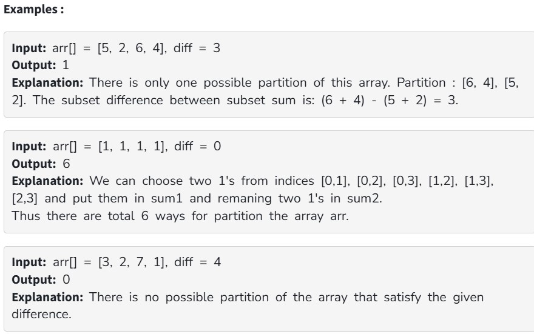

Given an array arr[] and an integer diff, count the number of ways to partition the array into two subsets such that the difference between their sums is equal to diff.

Note: A partition in the array means dividing an array into two subsets say S1 and S2 such that the union of S1 and S2 is equal to the original array and each element is present in only one of the subsets.

Constraint:

1 ≤ arr.size() ≤ 50

0 ≤ diff ≤ 50

0 ≤ arr[i] ≤ 6

