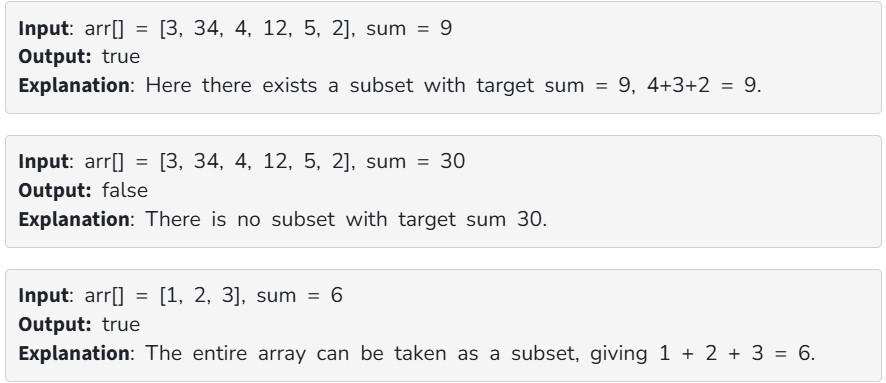

Given an array of positive integers arr[] and a value sum, determine if there is a subset of arr[] with sum equal to given sum. 

Examples:

Constraints:
1 <= arr.size() <= 200

1<= arr[i] <= 200

1<= sum <= 10^4
