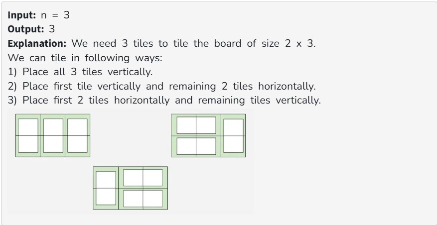
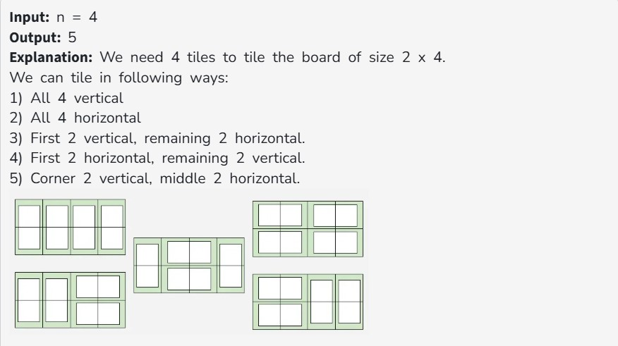

Given a floor of dimensions 2 x n and tiles of dimensions 2 x 1, the task is to find the number of ways the floor can be tiled. A tile can either be placed horizontally i.e as a 1 x 2 tile or vertically i.e as 2 x 1 tile. 

Note: Two tiling arrangements are considered different if the placement of at least one tile differs.

Examples :

Constraints:

1 ≤ n ≤ 45
