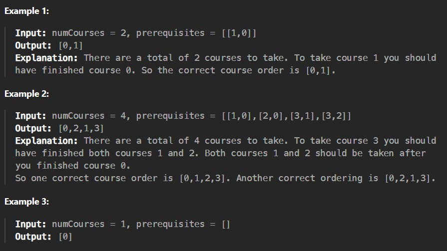

There are a total of numCourses courses you have to take, labeled from 0 to numCourses - 1. You are given an array prerequisites where prerequisites[i] = [ai, bi] indicates that you must take course bi first if you want to take course ai.

For example, the pair [0, 1], indicates that to take course 0 you have to first take course 1.

Return the ordering of courses you should take to finish all courses. If there are many valid answers, return any of them. If it is impossible to finish all courses, return an empty array.

Constraints:

1 <= numCourses <= 2000

0 <= prerequisites.length <= numCourses * (numCourses - 1)

prerequisites[i].length == 2

0 <= ai, bi < numCourses

ai != bi

All the pairs [ai, bi] are distinct.

Intuition:

- Represent the courses as a directed graph: edge bi → ai means you must take bi before ai.

- Compute in‑degree (number of prerequisites) for each course.

- Use Kahn’s algorithm (BFS topological sort):

- Start with all courses that have in‑degree = 0.

- Repeatedly take a course from the queue, add it to the ordering, and reduce the in‑degree of its neighbors.

- If a neighbor’s in‑degree becomes 0, push it into the queue.

- At the end:

- If the ordering contains all courses → return it.

- Otherwise (cycle exists) → return empty array.
