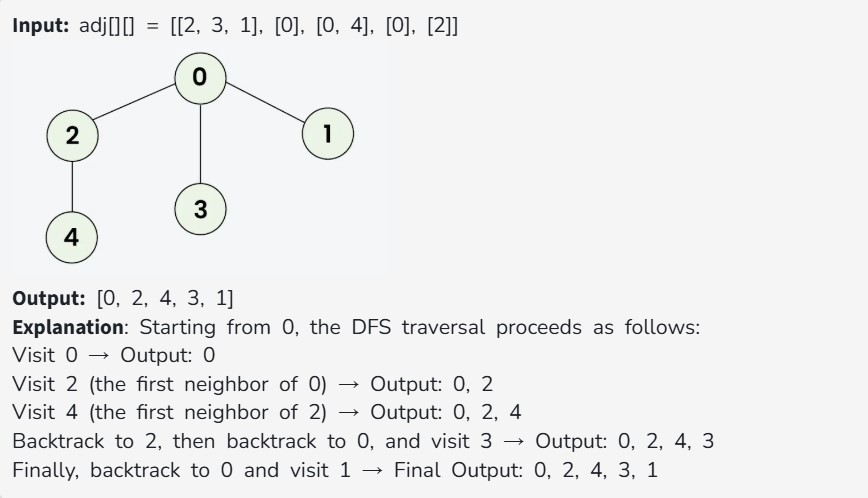
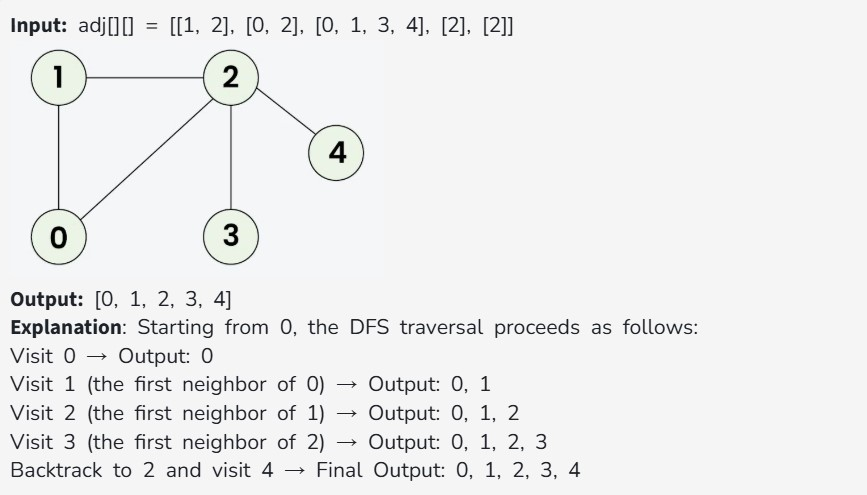

Given a connected undirected graph containing V vertices represented by a 2-d adjacency list adj[][], where each adj[i] represents the list of vertices connected to vertex i. Perform a Depth First Search (DFS) traversal starting from vertex 0, visiting vertices from left to right as per the given adjacency list, and return a list containing the DFS traversal of the graph.

Note: Do traverse in the same order as they are in the given adjacency list.

Examples:

Constraints:
1 ≤ V = adj.size() ≤ 10^4

0 ≤ adj[i][j] ≤ 10^4
