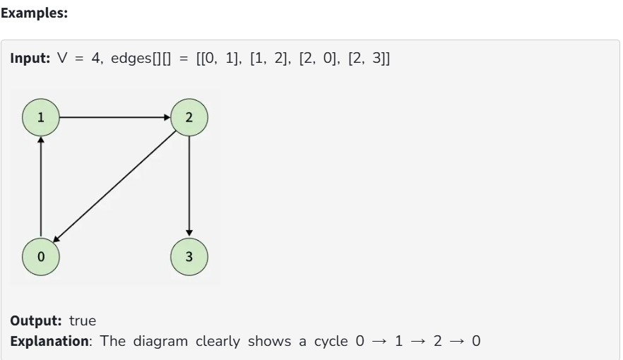
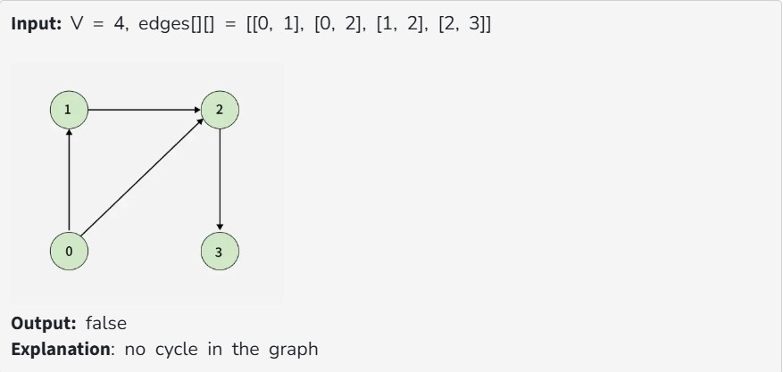

Given a Directed Graph with V vertices (Numbered from 0 to V-1) and E edges, check whether it contains any cycle or not.

The graph is represented as a 2D vector edges[][], where each entry edges[i] = [u, v] denotes an edge from vertex u to v.

Constraints:

1 ≤ V ≤ 10^5

0 ≤ E ≤ 10^5

0 ≤ edges[i][0], edges[i][1] < V

Intuition: 

To detect a cycle in a directed graph, we use Depth First Search (DFS). In DFS, we go as deep as possible from a starting node. If during this process, we reach a node that we’ve already visited in the same DFS path, it means we’ve gone back to an ancestor — this shows a cycle exists.
But there’s a problem: When we start DFS from one node, some nodes get marked as visited. Later, when we start DFS from another node, those visited nodes may appear again, even if there’s no cycle.
So, using only visited[] isn’t enough.

To fix this, we use two arrays:

visited[] - marks nodes visited at least once.

recStack[] - marks nodes currently in the recursion (active) path.

If during DFS we reach a node that’s already in the recStack, we’ve found a path from the current node back to one of its ancestors, forming a cycle. As soon as we finish exploring all paths from a node, we remove it from the recursion stack by marking recStack[node] = false. This ensures that only the nodes in the current DFS path are tracked.
