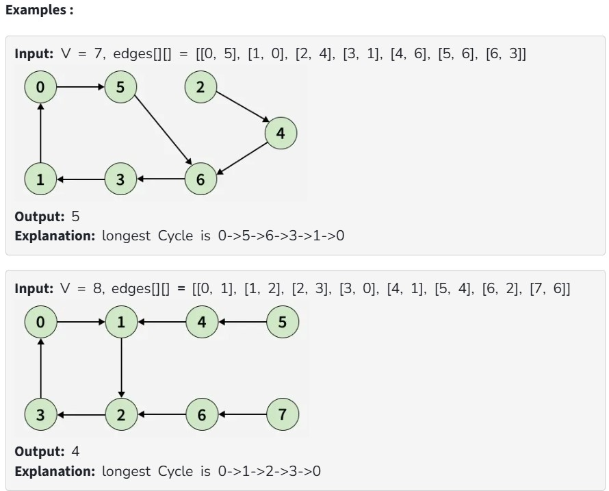

Given an directed graph with V vertices numbered from 0 to V-1 and E edges, represented as a 2D array edges[][], where each entry edges[i] = [u, v] denotes an edge between vertices u and v. Each node has at most one outgoing edge.

Your task is to find the length of the longest cycle present in the graph. If no cycle exists, return -1.

Note: A cycle is a path that starts and ends at the same vertex.

Constraints:

1 ≤ V, E ≤ 10^4

0 ≤ edges[i][0], edges[i][1] < V
