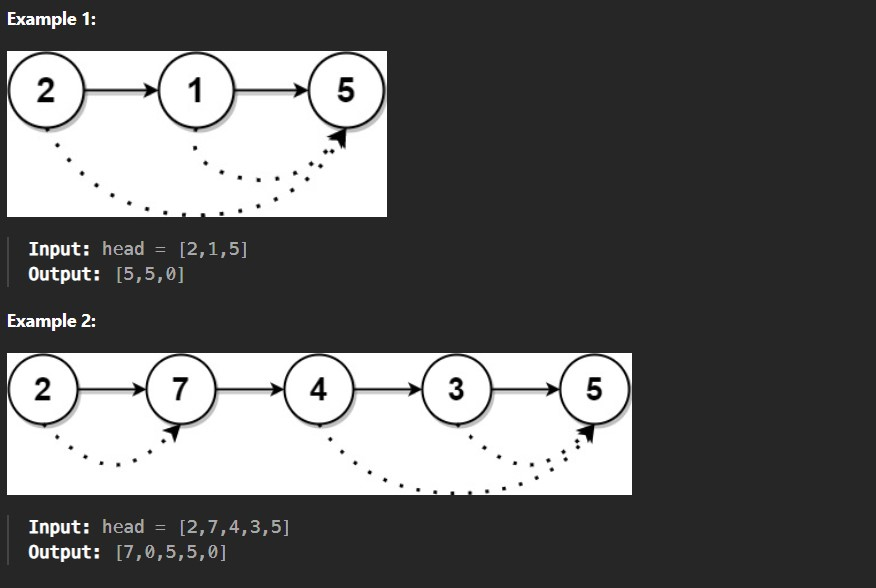

You are given the head of a linked list with n nodes.

For each node in the list, find the value of the next greater node. That is, for each node, find the value of the first node that is next to it and has a strictly larger value than it.

Return an integer array answer where answer[i] is the value of the next greater node of the ith node (1-indexed). If the ith node does not have a next greater node, set answer[i] = 0.

 

 Constraints:

The number of nodes in the list is n.

1 <= n <= 10^4

1 <= Node.val <= 10^9
