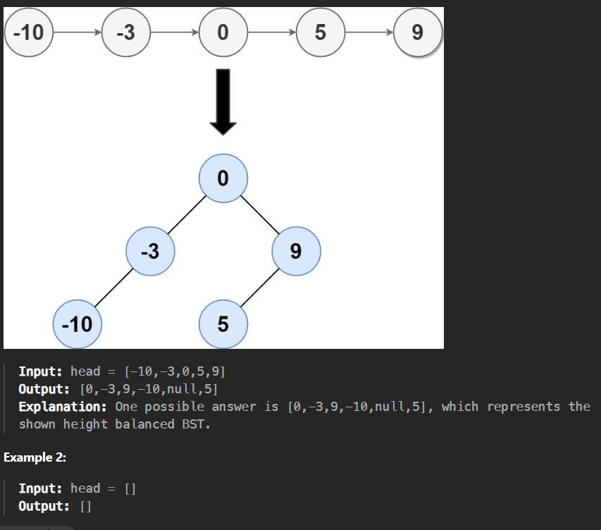

Given the head of a singly linked list where elements are sorted in ascending order, convert it to a height-balanced binary search tree.

In LLtoBST.cpp: An extra space in taken to add LL data to array and then apply the logic but in second file of cpp
SC is O(1)

Example 1:

Constraints:

The number of nodes in head is in the range [0, 2 * 10^4].

-10^5 <= Node.val <= 10^5
