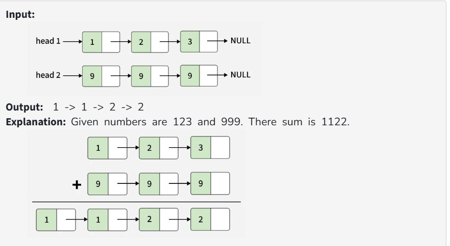
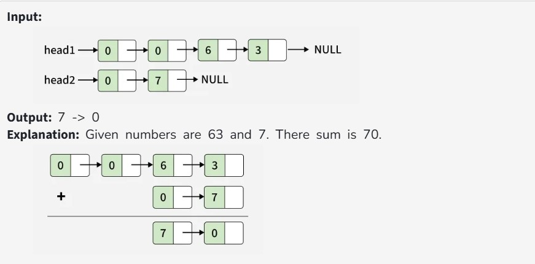

You are given the head of two singly linked lists head1 and head2 representing two non-negative integers. You have to return the head of the linked list representing the sum of these two numbers.

Note: There can be leading zeros in the input lists, but there should not be any leading zeros in the output list.

Constraints:

1 ≤ Number of nodes in head1, head2 ≤ 10^5

0 ≤ node->data ≤ 9

