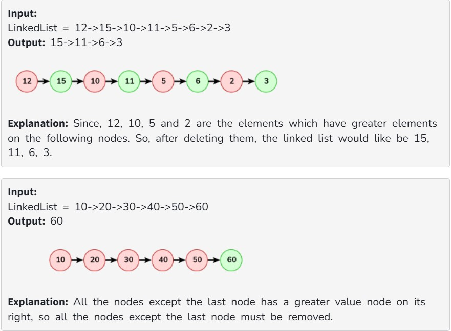

You are given the head of a linked list.

Remove every node which has a node with a greater value anywhere to the right side of it.

Return the head of the modified linked list.

Constraints:

The number of the nodes in the given list is in the range [1, 10^5].

1 <= Node.val <= 10^5
