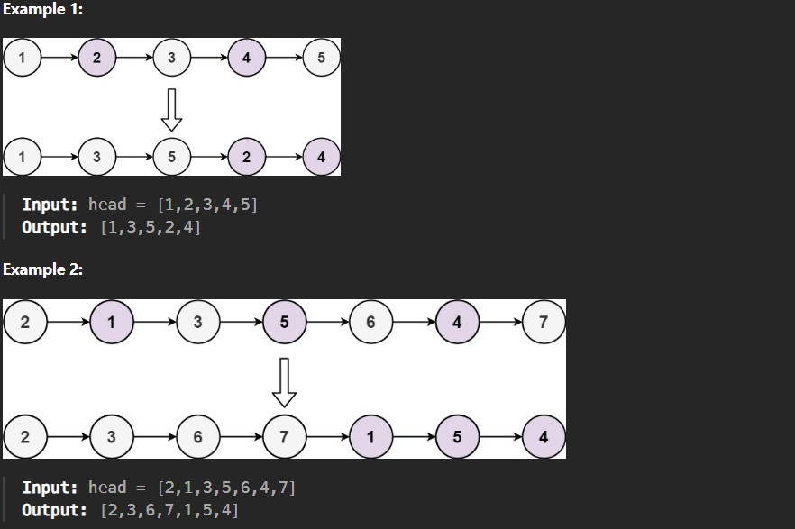

Given the head of a singly linked list, group all the nodes with odd indices together followed by the nodes with even indices, and return the reordered list.

The first node is considered odd, and the second node is even, and so on.

Note that the relative order inside both the even and odd groups should remain as it was in the input.

Constraints:

The number of nodes in the linked list is in the range [0, 10^4].

-10^6 <= Node.val <= 10^6
