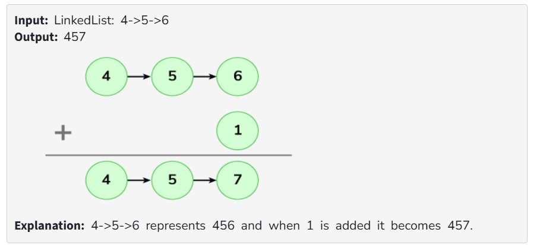

You are given a linked list where each element in the list is a node and have an integer data. You need to add 1 to the number formed by concatinating all the list node numbers together and return the head of the modified linked list. 

Note: The head represents the first element of the given array.

Examples :

Expected Time Complexity: O(n)

Expected Auxiliary Space: O(1)

Constraints:

1 <= len(list) <= 10^5

0 <= list[i] <= 9
