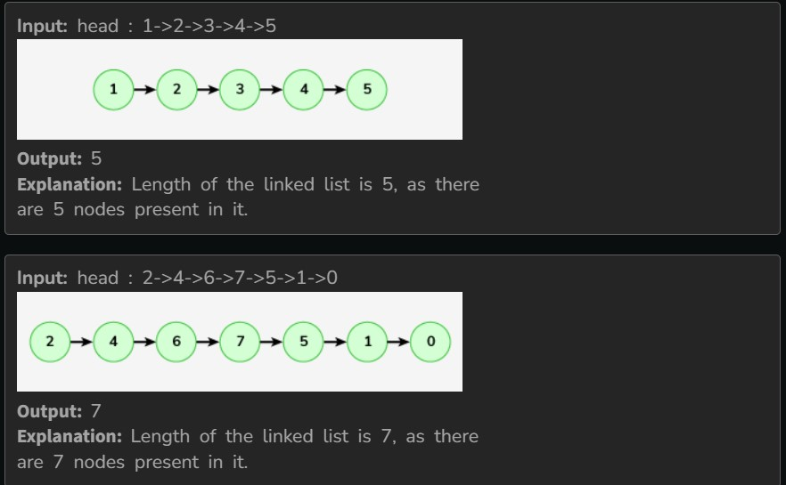

Given head of a singly linked list. The task is to find the length of the linked list, where length is defined as the number of nodes in the linked list.

Examples :

Constraints:

1 <= number of nodes <= 4*10^4

1 <= node->data <= 10^3
