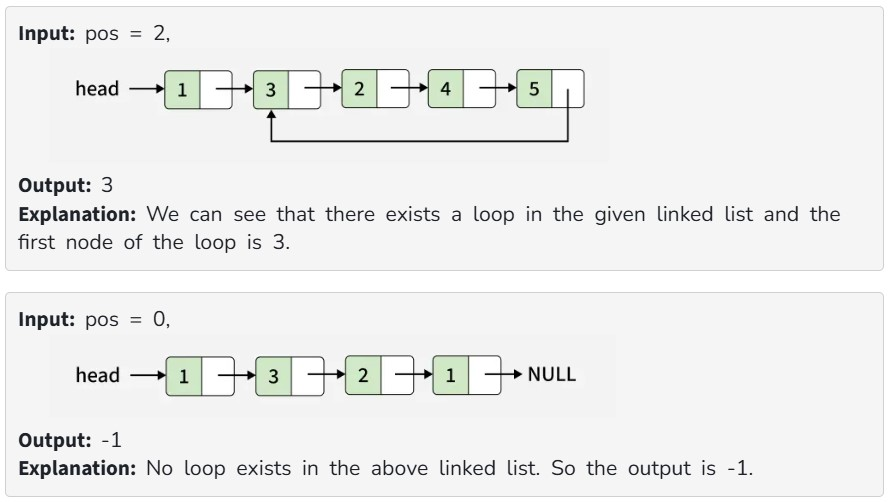

You are given the head of a singly linked list. If a loop is present in the linked list then return the first node of the loop else return -1.

Note: Internally, pos(1 based index) is used to denote the position of the node that tail's next pointer is connected to. If pos = 0, it means the last node points to null, indicating there is no loop. Note that pos is not passed as a parameter.

Examples:

Constraints:
1 ≤ no. of nodes ≤ 10^6

1 ≤ node->data ≤ 10^6 
