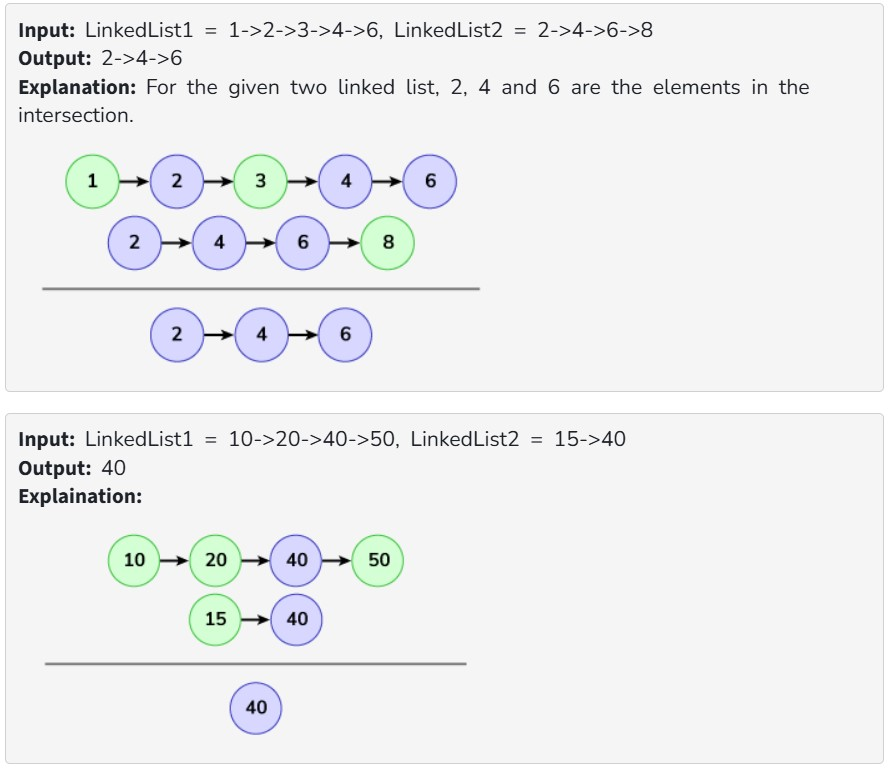

Given that two linked lists are sorted in increasing order, create a new linked list representing the intersection of the two linked lists. The new linked list should be made without changing the original lists.

Note: The elements of the linked list are not necessarily distinct.

Examples:

Constraints:

1 <= size of linked lists <= 10^4

1 <= node->data<= 10^4
