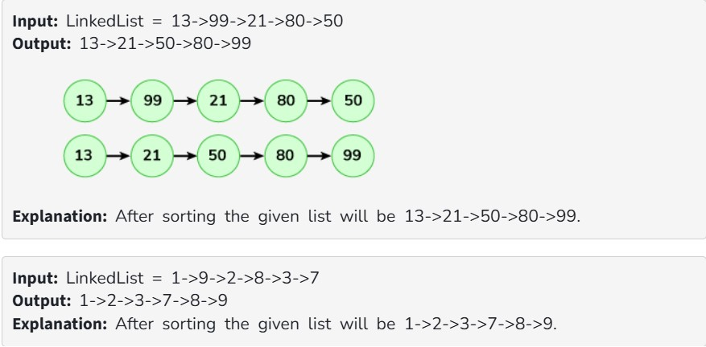

You are given a Linked list. The list is in alternating ascending and descending orders. Sort the given linked list in non-decreasing order.

Examples:

Constraints:

1 <= number of nodes <= 10^4

0 <= node->data <= 10^4

Expected Complexities:

Time Complexity: O(n)

Auxiliary Space: O(1)
