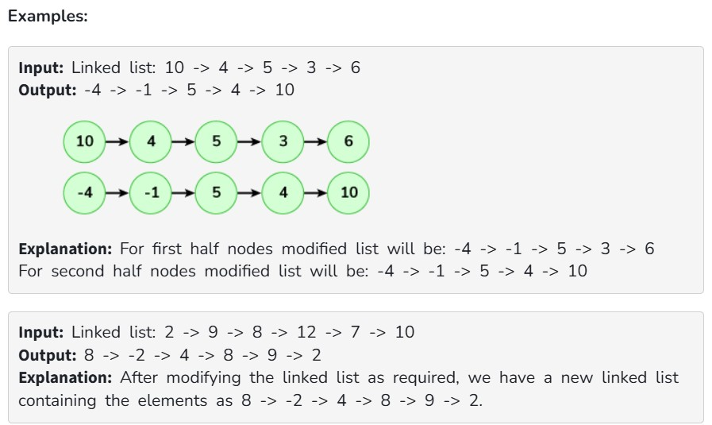

Given a singly linked list. Modify the Linked list as follows:

Modify the value of the first half nodes such that 1st node's new value is equal to the value of the last node minus the first node's current value, 2nd node's new value is equal to the second last nodes value minus 2nd nodes current value, likewise for first half nodes.
Replace the second half of nodes with the initial values of the first half of nodes (values before modifying the nodes).

If size of it is odd then the value of the middle node remains unchanged.

Constraints:

1 <= size of linked list <= 10^6

-10^5 <= data of nodes <= 10^6

