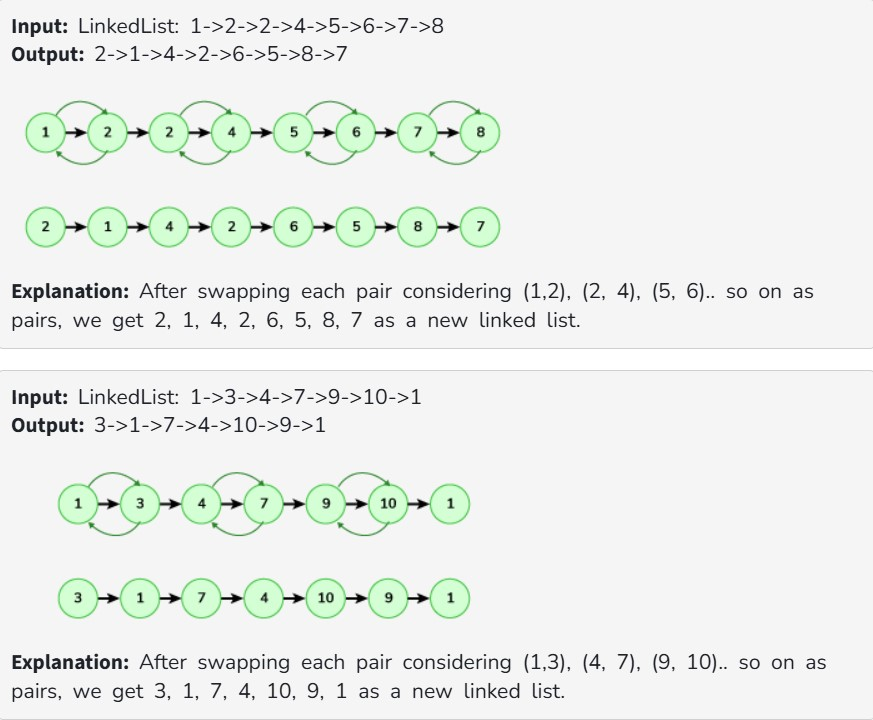

Given a singly linked list. The task is to swap elements in the linked list pairwise. For example, if the input list is 1 2 3 4, the resulting list after swaps will be 2 1 4 3.

Note: You need to swap the nodes, not only the data. If only data is swapped then the driver code will print -1.

Examples:

Constraints:

1 ≤ size of linked list ≤ 10^6

1 ≤ elements of linked list ≤ 10^6
