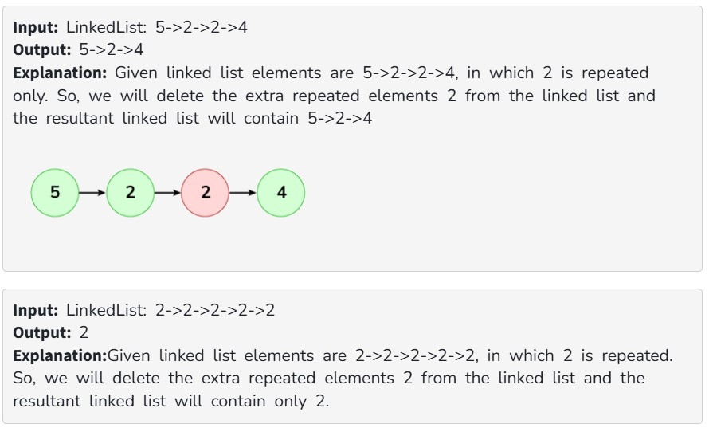

Given an unsorted linked list. The task is to remove duplicate elements from this unsorted Linked List. When a value appears in multiple nodes, the node which appeared first should be kept, all other duplicates are to be removed.

Examples:

Expected Time Complexity: O(n)

Expected Space Complexity: O(n)

Constraints:

1 <= number of nodes <= 10^6

0 <= node->data <= 10^6
