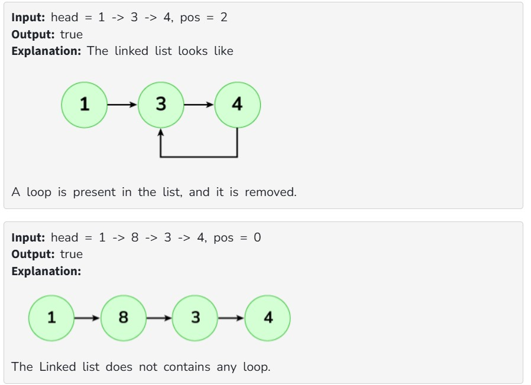
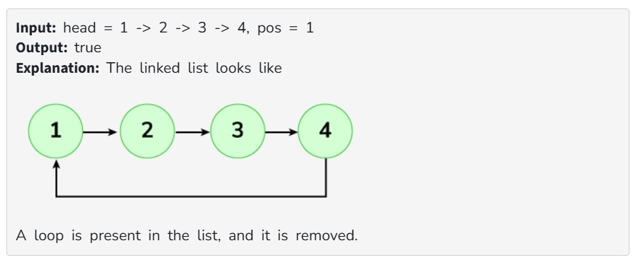

Given the head of a singly linked list, the task is to remove a cycle if present. A cycle exists when a node's next pointer points back to a previous node, forming a loop. Internally, a variable pos denotes the index of the node where the cycle starts, but it is not passed as a parameter. The terminal will print true if a cycle is removed otherwise, it will print false.

Examples:

Constraints:
1 ≤ size of linked list ≤ 10^5
