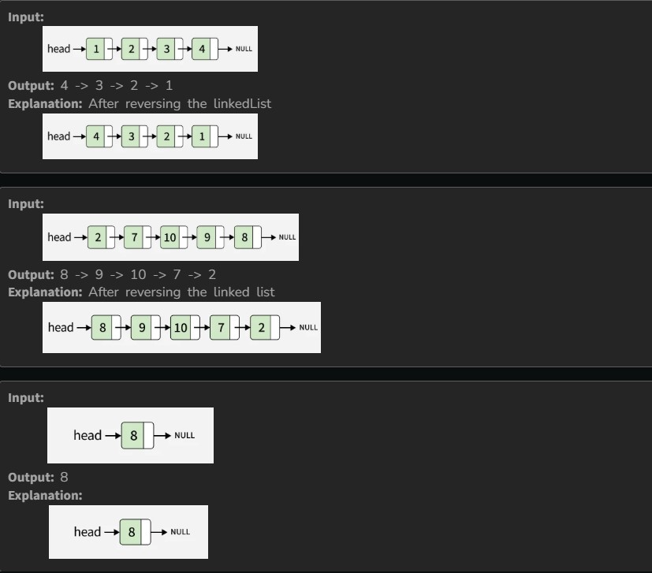

You are given the head of a singly linked list. You have to reverse the linked list and return the head of the reversed list.

Examples:

Constraints:

1 ≤ number of nodes ≤ 10^5

1 ≤ node->data ≤ 10
