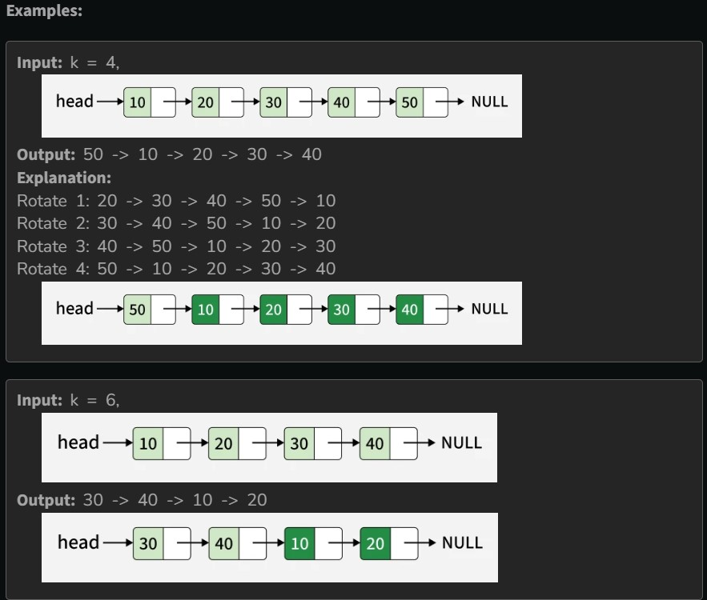

Given the head of a linked list, rotate the list to the right by k places.

Example 1:

Constraints:

The number of nodes in the list is in the range [0, 500].

-100 <= Node.val <= 100

0 <= k <= 2 * 10^9
