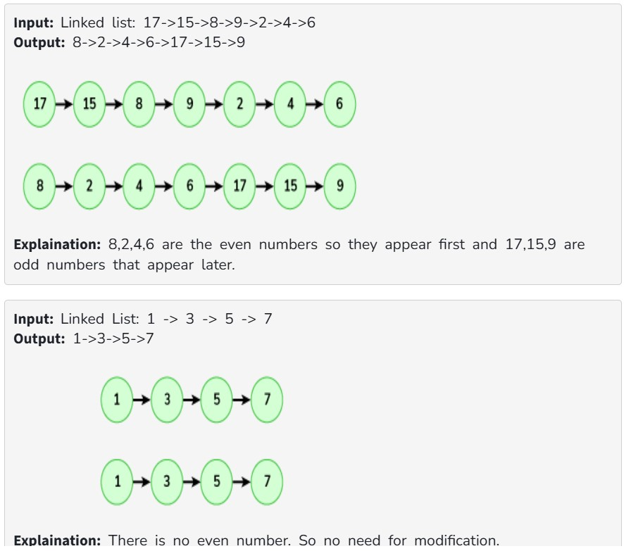

Given a link list, modify the list such that all the even numbers appear before all the odd numbers in the modified list. The order of appearance of numbers within each segregation should be the same as that in the original list.

NOTE: Don't create a new linked list, instead rearrange the provided one.

Examples:

Constraints:

1 ≤ size of linked list ≤ 10^5

1 ≤ Each element of the list ≤ 10^5
