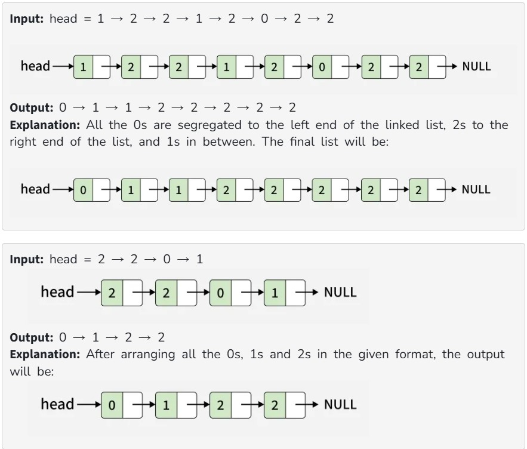

Given the head of a linked list where nodes can contain values 0s, 1s, and 2s only. Your task is to rearrange the list so that all 0s appear at the beginning, followed by all 1s, and all 2s are placed at the end.

Examples:

Constraints:

1 ≤ no. of nodes ≤ 10^6

0 ≤ node->data ≤ 2
