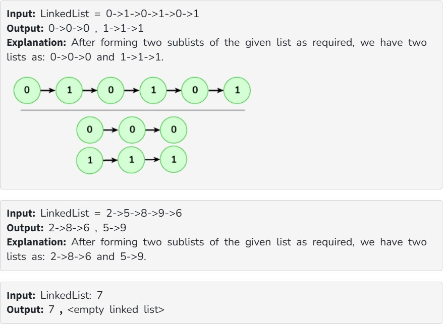

Given a singly linked list's head. Your task is to complete the function alternatingSplitList() that splits the given linked list into two smaller lists. The sublists should be made from alternating elements from the original list.
Note: 

The sublist should be in the order with respect to the original list.
You have to return an array containing the both sub-linked lists.

Examples:

Constraints:

1 <= number of nodes <= 100

1 <= node -> data <= 10^4
