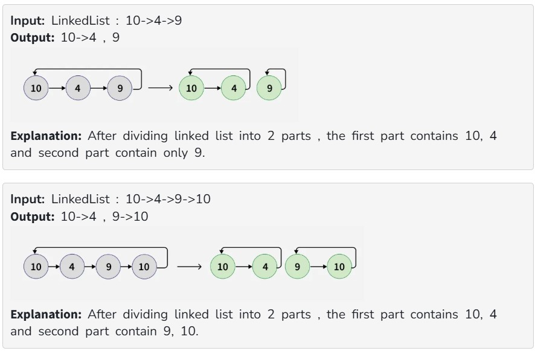

Given a Circular linked list. The task is split into two Circular Linked lists. If there are an odd number of nodes in the given circular linked list then out of the resulting two halved lists, the first list should have one node more than the second list.

Examples :

Constraints:

2 <= number of nodes <= 10^5

1 <= node->data <= 10^3
