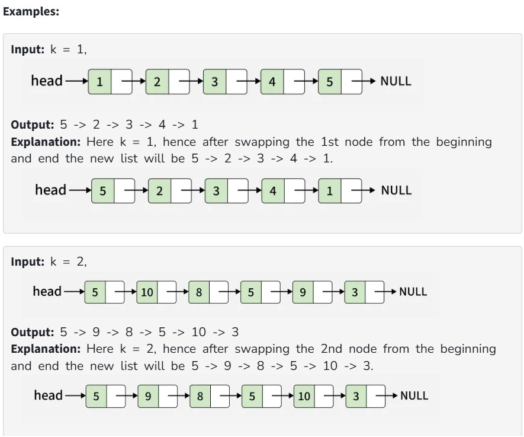

Given the head of a singly linked list and an integer k. Swap the kth node (1-based index) from the beginning and the kth node from the end of the linked list. Return the head of the final formed list and if it's not possible to swap the nodes return the original list.

Constraints:

1 ≤ list size ≤ 10^4

1 ≤ node->data ≤ 10^6

1 ≤ k ≤ 10^4
