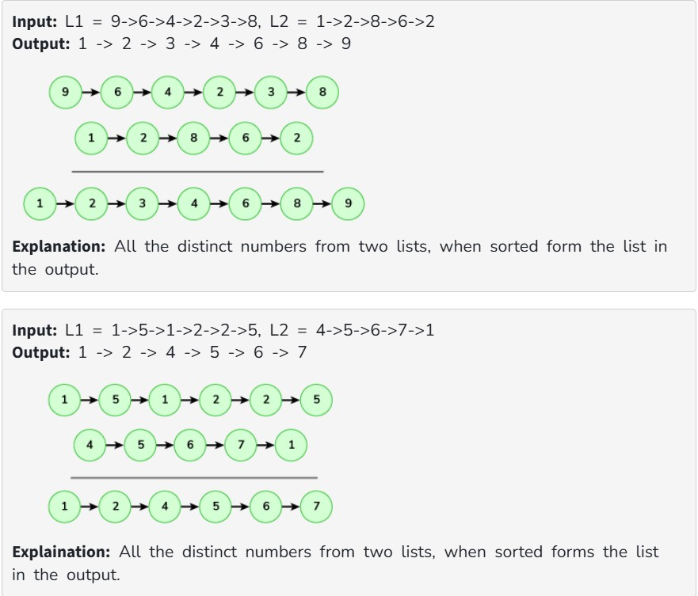

Given two linked lists (L1 & L2), your task is to complete the function makeUnion(), which returns the union list of two linked lists. This union list should include all the distinct elements only and it should be sorted in ascending order.

Example: 

Constraints:
1<=size of both linked lists<=10^5

1<= data of nodes<=10^5
