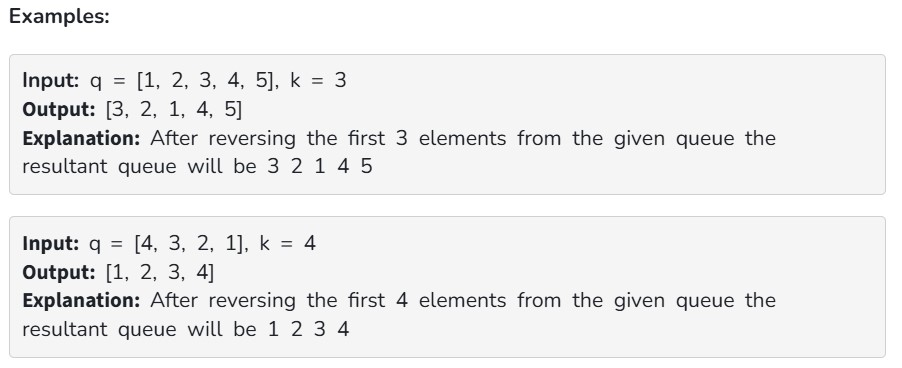

Given an integer k and a queue of integers, we need to reverse the order of the first k elements of the queue, leaving the other elements in the same relative order.

Only following standard operations are allowed on queue.

enqueue(x) : Add an item x to rear of queue

dequeue() : Remove an item from front of queue

size() : Returns number of elements in queue.

front() : Finds front item.

Note: The above operations represent the general processings. In-built functions of the respective languages can be used to solve the problem.

"If the size of queue is smaller than the given k , then return the original queue."

Constraints:

1<=q[i]<=10^5

1<=q.size()<=10^5

1<=k<=10^5

