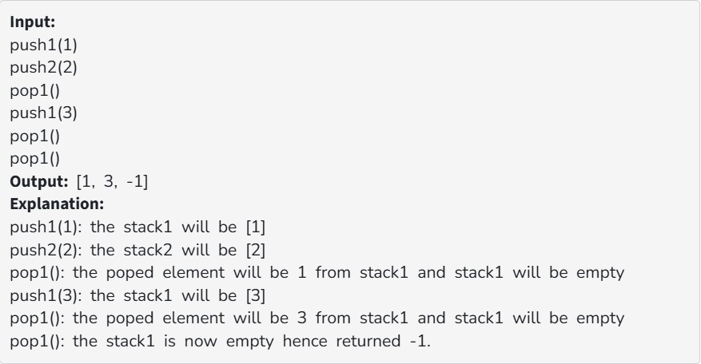
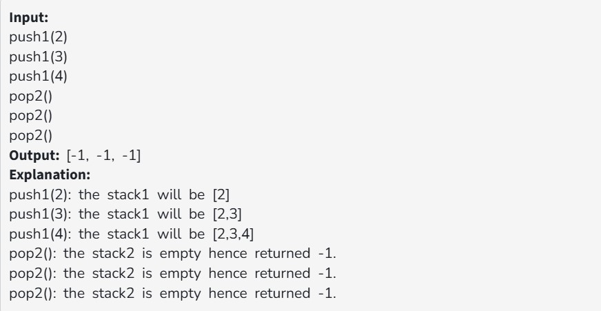

You are given an array of a fixed size. Your task is to efficiently implement two stacks in this single array.

The following operations must be supported:

(i) twoStacks : Initialize the data structures and variables to be used to implement  2 stacks in one array.

(ii) push1(x) : pushes element into the first stack.

(iii) push2(x) : pushes element into the second stack.

(iv) pop1() : pops an element from the first stack and returns the popped element. If the first stack is empty, it should return -1.

(v) pop2() : pops an element from the second stack and returns the popped element. If the second stack is empty, it should return -1.

Examples:

Constraints:

1 ≤ number of queries ≤ 10^4

1 ≤ number of elements in the stack ≤ 100

The sum of the count of elements in both the stacks < size of the given array
