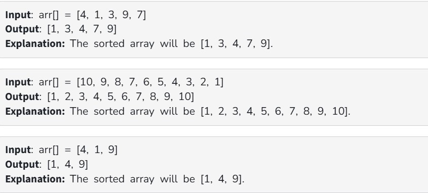

Given an array arr[] of positive integers.The task is to complete the insertsort() function which is used to implement Insertion Sort.

Examples:

Constraints:

1 ≤ arr.size() ≤ 1000

1 ≤ arr[i] ≤ 10000
