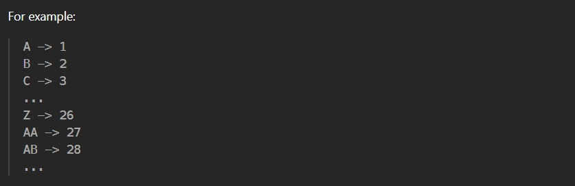
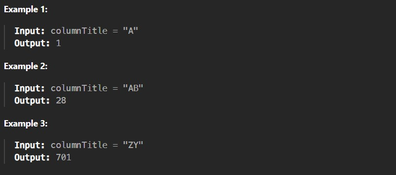

Given a string columnTitle that represents the column title as appears in an Excel sheet, return its corresponding column number.

 

Constraints:

1 <= columnTitle.length <= 7

columnTitle consists only of uppercase English letters.

columnTitle is in the range ["A", "FXSHRXW"].
