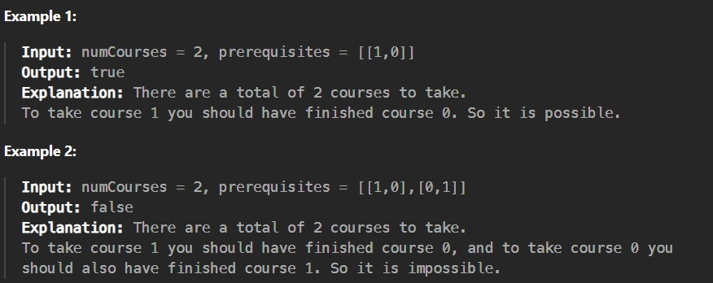

You are given two strings s1 and s2, both of length n, consisting of lowercase English letters.

You can apply the following operation on any of the two strings any number of times:

Choose any two indices i and j such that i < j and the difference j - i is even, then swap the two characters at those indices in the string.  

Return true if you can make the strings s1 and s2 equal, and false otherwise.

 

Constraints:

n == s1.length == s2.length

1 <= n <= 10^5

s1 and s2 consist only of lowercase English letters
