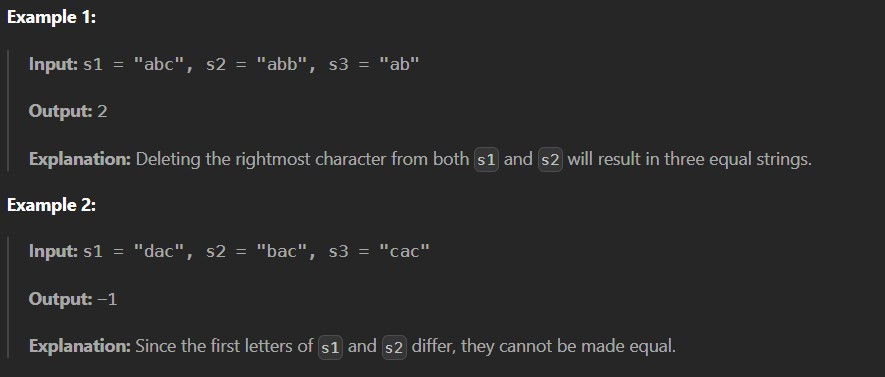

You are given three strings: s1, s2, and s3. In one operation you can choose one of these strings and delete its rightmost character. Note that you cannot completely empty a string.

Return the minimum number of operations required to make the strings equal. If it is impossible to make them equal, return -1.

Constraints:

1 <= s1.length, s2.length, s3.length <= 100

s1, s2 and s3 consist only of lowercase English letters.
