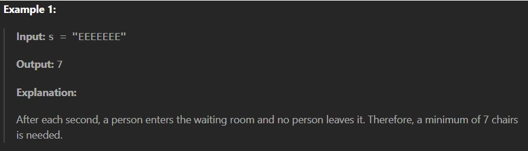
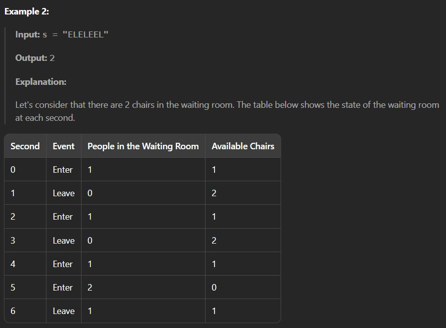
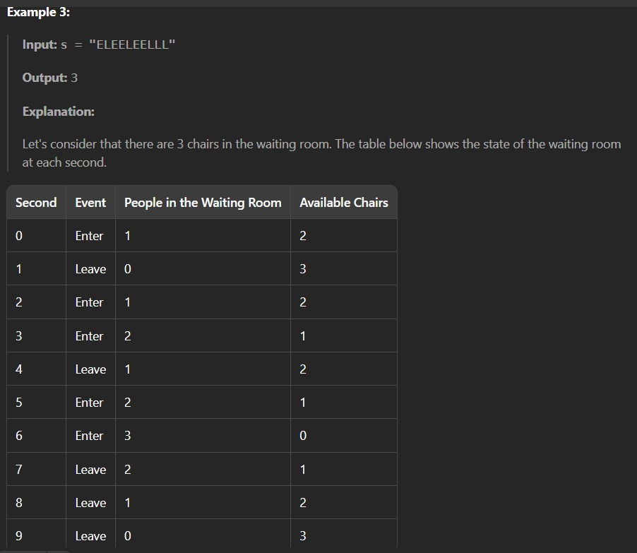

You are given a string s. Simulate events at each second i:

If s[i] == 'E', a person enters the waiting room and takes one of the chairs in it.

If s[i] == 'L', a person leaves the waiting room, freeing up a chair.

Return the minimum number of chairs needed so that a chair is available for every person who enters the waiting room given that it is initially empty.

Constraints:

1 <= s.length <= 50

s consists only of the letters 'E' and 'L'.

s represents a valid sequence of entries and exits.
