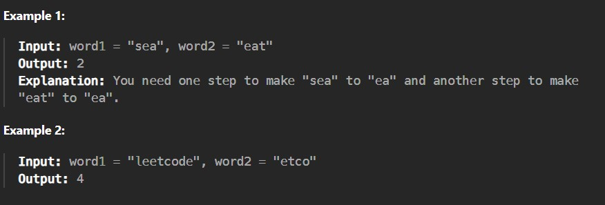

Given two strings word1 and word2, return the minimum number of steps required to make word1 and word2 the same.

In one step, you can delete exactly one character in either string.

Constraints:

1 <= word1.length, word2.length <= 500

word1 and word2 consist of only lowercase English letters.
