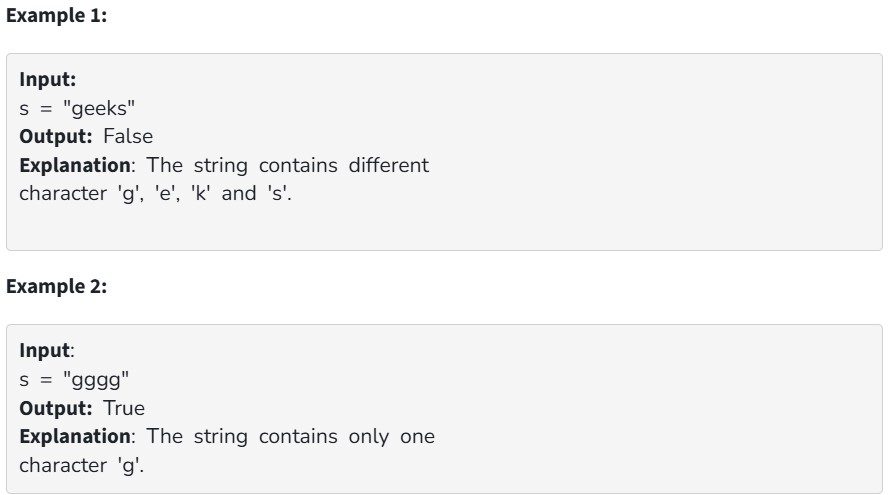

Given a string, check if all its characters are the same or not.

Your Task:

You don't need to read input or print anything. Your task is to complete the function check() which takes a string as input and returns True if all the characters in the string are the same. Else, it returns False.

Expected Time Complexity: O(|S|).

Expected Auxiliary Space: O(1).

