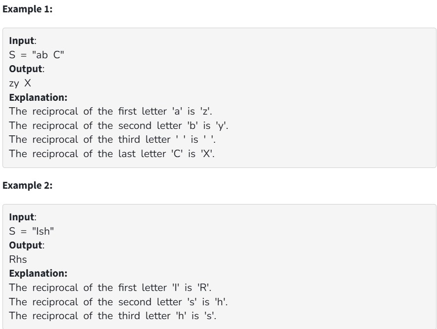

Given a string S, we need to find reciprocal of it. The reciprocal of the letter is found by finding the difference between the position of the letter and the first letter ‘A’. Then decreasing the same number of steps from the last letter ‘Z’. The character that we reach after above steps is reciprocal.
Reciprocal of Z is A and vice versa because if you reverse the position of the alphabet A will be in the position of Z.
Similarly, if the letter is a small case then the first letter will be 'a' and the last letter will be 'z'. and the definition of reciprocal remains the same.

Note: If the character is not a letter its reciprocal will be the same character.

Your Task:  

You don't need to read input or print anything. Your task is to complete the function reciprocalString() which takes the string S as input parameter and returns the reciprocal string.

Expected Time Complexity: O(|S|) where |S| denotes the length of the string S.

Expected Auxiliary Space: O(|S|)

Constraints:

1 <= |S| <= 10^4
