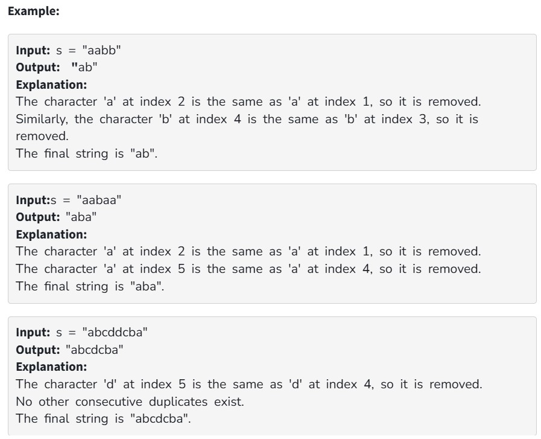

You are given a string s, consisting of lowercase alphabets. Your task is to remove consecutive duplicate characters from the string. 

Constraints:

1 ≤ n ≤ 10^6

All characters in the string are lowercase English alphabets.
