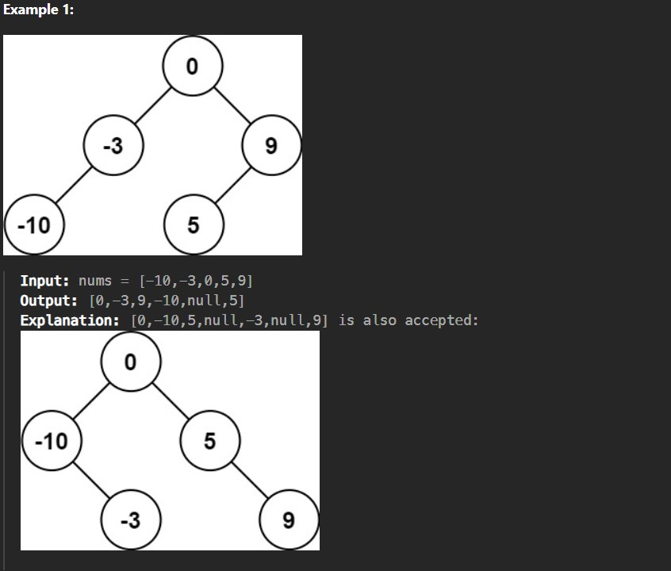
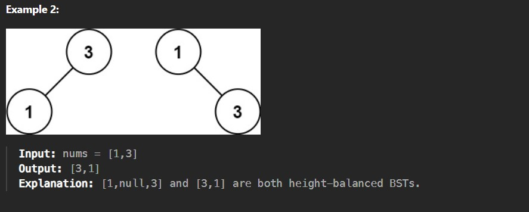

Given an integer array nums where the elements are sorted in ascending order, convert it to a height-balanced binary search tree.

Constraints:

1 <= nums.length <= 10^4

-10^4 <= nums[i] <= 10^4

nums is sorted in a strictly increasing order.
