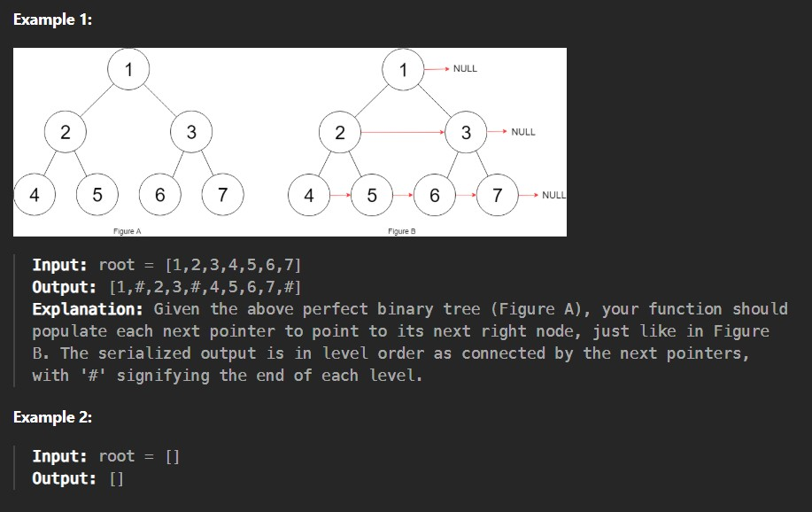

You are given a perfect binary tree where all leaves are on the same level, and every parent has two children. The binary tree has the following definition:

struct Node {

  int val;
  
  Node *left;
  
  Node *right;
  
  Node *next;

}

Populate each next pointer to point to its next right node. If there is no next right node, the next pointer should be set to NULL.

Initially, all next pointers are set to NULL.

Constraints:

The number of nodes in the tree is in the range [0, 2^12 - 1].
-1000 <= Node.val <= 1000
