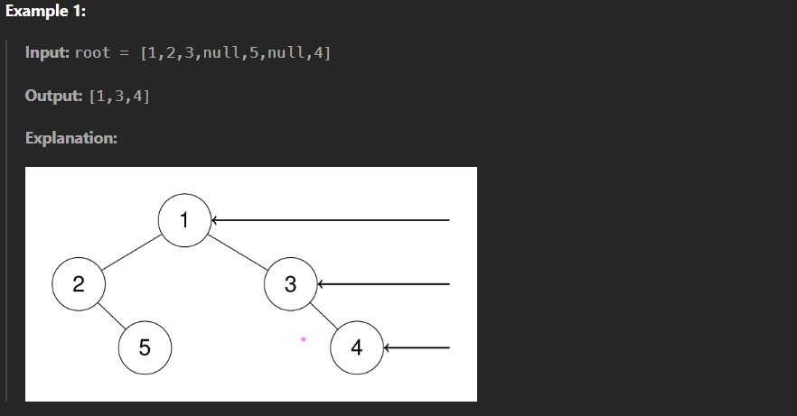
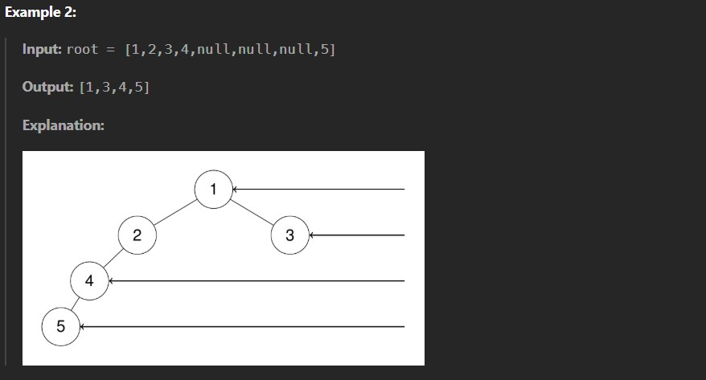
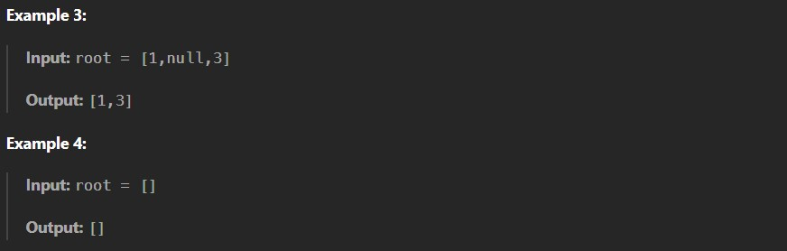

Given the root of a binary tree, imagine yourself standing on the right side of it, return the values of the nodes you can see ordered from top to bottom.

Constraints:

The number of nodes in the tree is in the range [0, 100].

-100 <= Node.val <= 100
