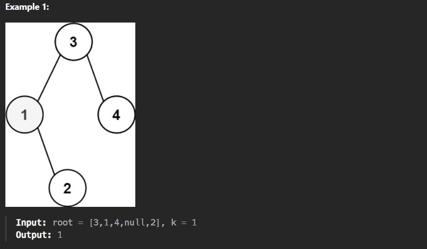
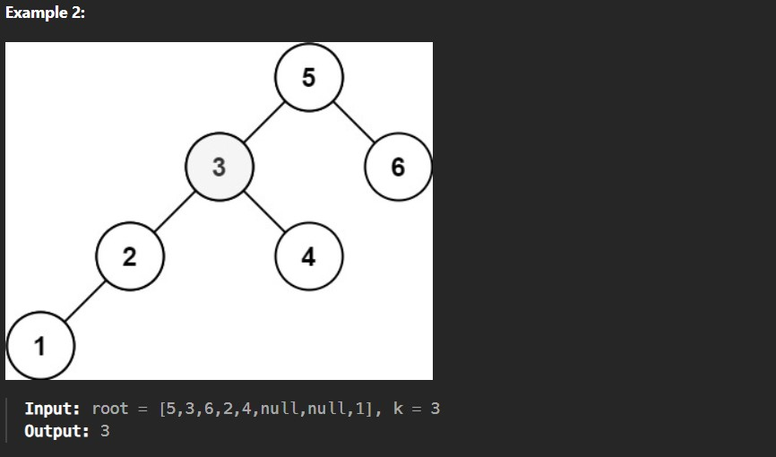

Given the root of a binary search tree, and an integer k, return the kth smallest value (1-indexed) of all the values of the nodes in the tree.

Constraints:

The number of nodes in the tree is n.

1 <= k <= n <= 10^4

0 <= Node.val <= 10^4
