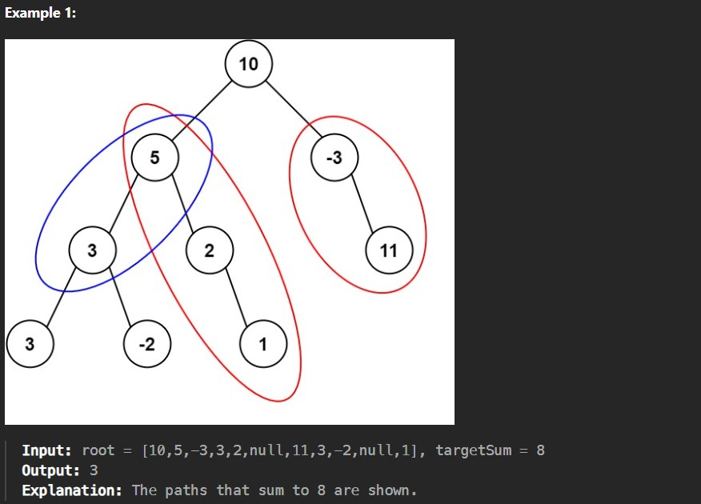
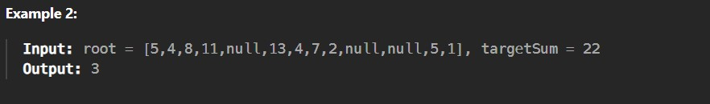

Given the root of a binary tree and an integer targetSum, return the number of paths where the sum of the values along the path equals targetSum.

The path does not need to start or end at the root or a leaf, but it must go downwards (i.e., traveling only from parent nodes to child nodes).

 

Constraints:

The number of nodes in the tree is in the range [0, 1000].

-10^9 <= Node.val <= 10^9

-1000 <= targetSum <= 1000
