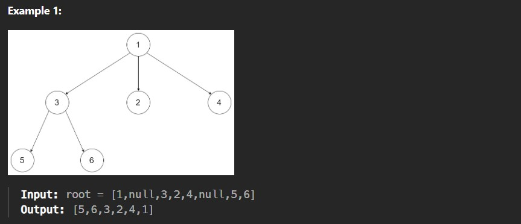
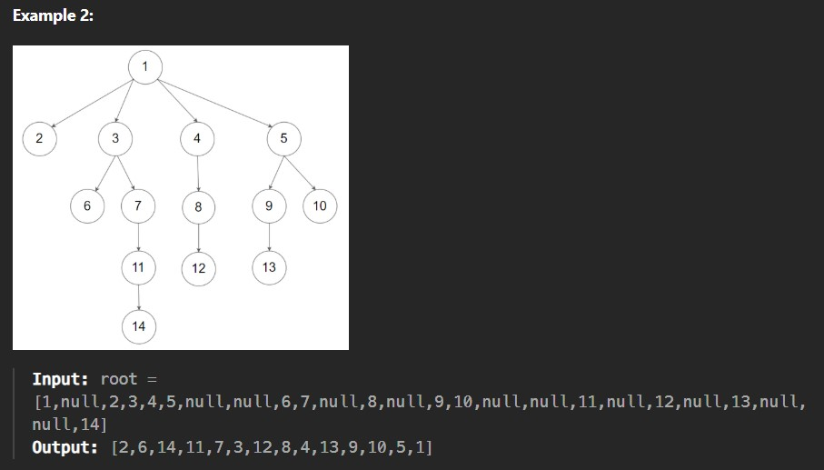

Given the root of an n-ary tree, return the postorder traversal of its nodes' values.

Nary-Tree input serialization is represented in their level order traversal. Each group of children is separated by the null value (See example

Example1:

Constraints:

The number of nodes in the tree is in the range [0, 10^4].

0 <= Node.val <= 10^4

The height of the n-ary tree is less than or equal to 1000.
