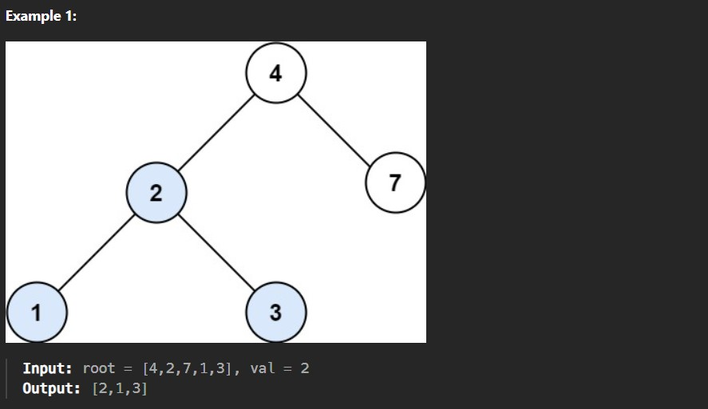
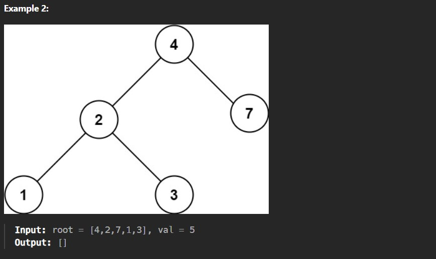

You are given the root of a binary search tree (BST) and an integer val.

Find the node in the BST that the node's value equals val and return the subtree rooted with that node. If such a node does not exist, return null.

Constraints:

The number of nodes in the tree is in the range [1, 5000].

1 <= Node.val <= 10^7

root is a binary search tree.

1 <= val <= 10^7
