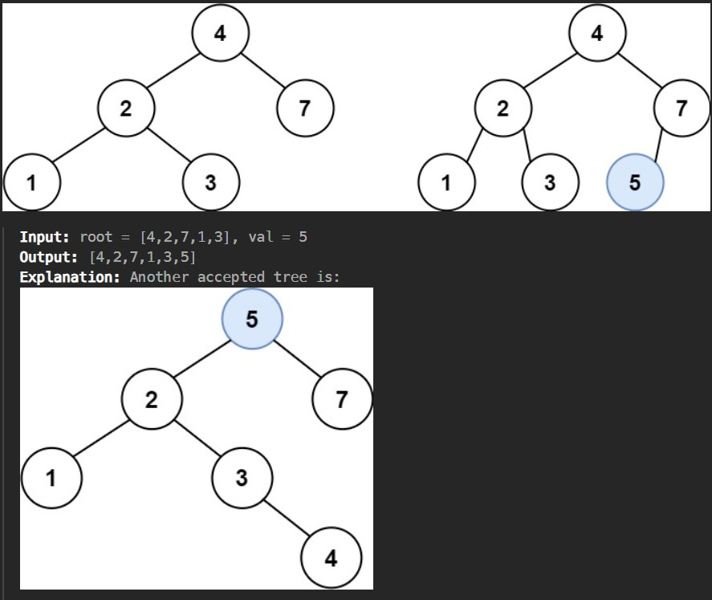
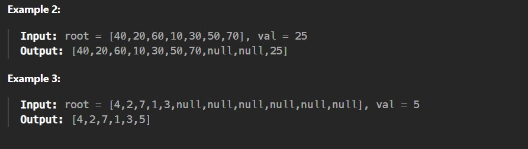

You are given the root node of a binary search tree (BST) and a value to insert into the tree. Return the root node of the BST after the insertion. It is guaranteed that the new value does not exist in the original BST.

Notice that there may exist multiple valid ways for the insertion, as long as the tree remains a BST after insertion. You can return any of them.

 

 

 Constraints:

The number of nodes in the tree will be in the range [0, 10^4].

-10^8 <= Node.val <= 10^8

All the values Node.val are unique.

-10^8 <= val <= 10^8

It's guaranteed that val does not exist in the original BST.
