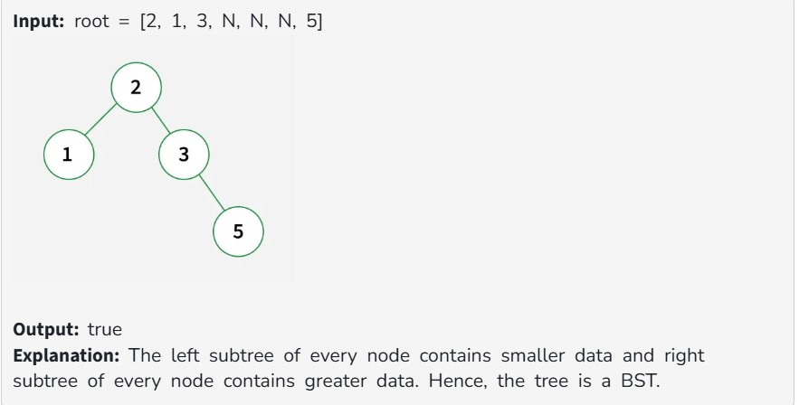
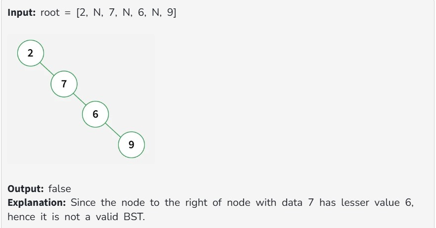
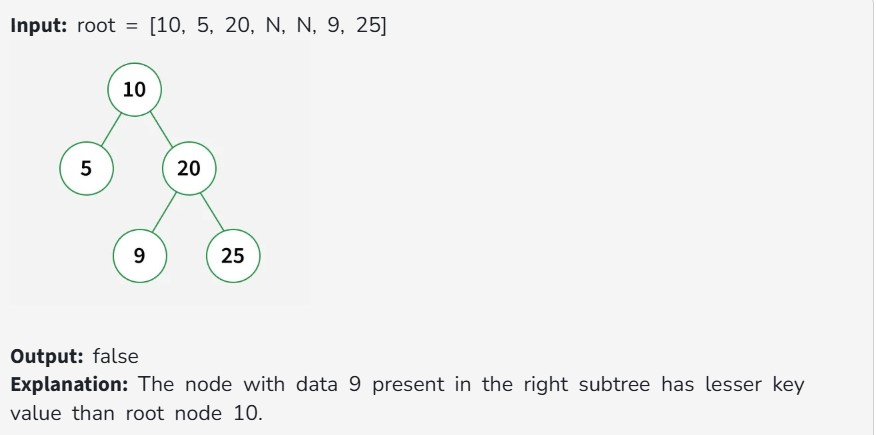

Given the root of a binary tree. Check whether it is a BST or not.

A BST is defined as follows:

The left subtree of a node contains only nodes with data less than the node's data.

The right subtree of a node contains only nodes with data greater than the node's data.

Both the left and right subtrees must also be binary search trees.

Note: We are considering that BSTs can not contain duplicate Nodes.

Constraints:

1 ≤ number of nodes ≤ 10^5

1 ≤ node->data ≤ 10^9
