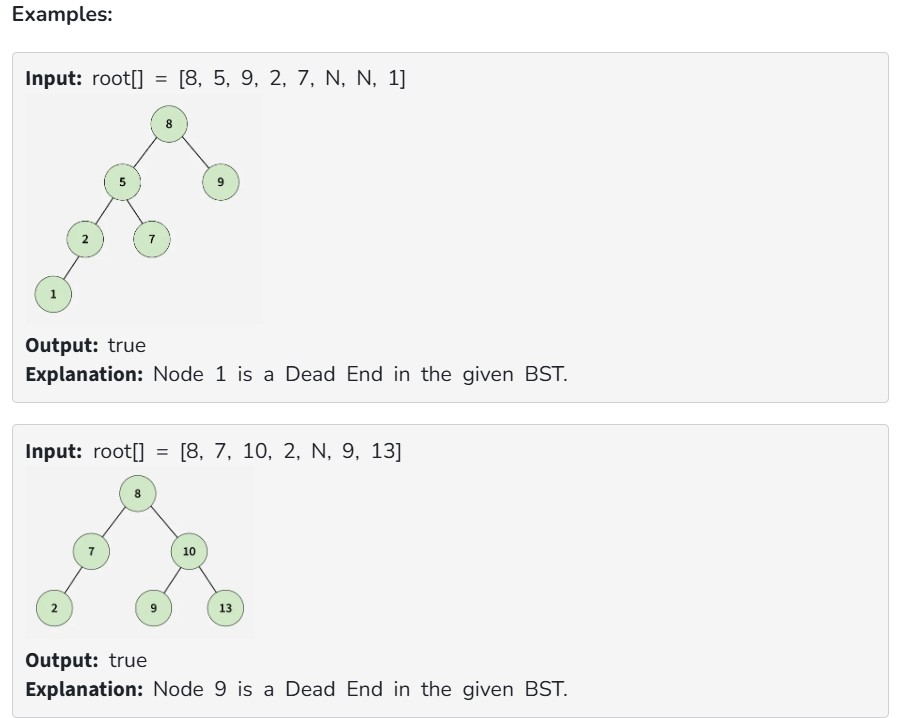

You are given a Binary Search Tree (BST) containing unique positive integers greater than 0.

Your task is to determine whether the BST contains a dead end.

Note: A dead end is a leaf node in the BST such that no new node can be inserted in the BST at or below this node while maintaining the BST property and the constraint that all node values must be > 0.

Constraints:
1 ≤ number of nodes ≤ 3000

1 ≤ node->data ≤ 10^5
